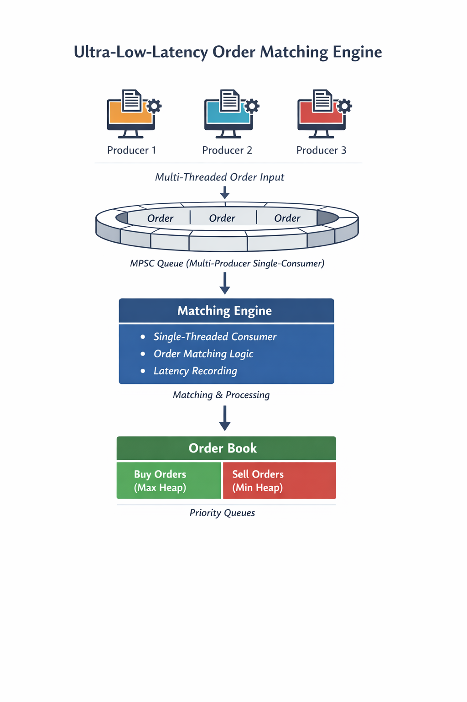

# 🚀 Ultra-Low-Latency Order Matching Engine

<p align="center">
  
  
  
</p>

<p align="center">
  High-performance lock-free matching engine built in Java to explore low-latency systems design, cache-aware concurrency, and mechanical sympathy principles used in trading infrastructure.
</p>

---

# 📊 Performance Snapshot

| Metric | Result |
|---|---|
| Throughput | 971K+ trades/sec |
| Runtime | 60s sustained load |
| P50 Latency | 5.6 µs |
| P95 Latency | 7.3 µs |
| P99 Latency | 23 µs |
| Processing Latency (P50) | ~300 ns |

### Environment

| Component | Value |
|---|---|
| CPU | Intel i5-7300HQ (4 cores) |
| RAM | 8 GB |
| Java | 17 LTS |
| OS | Windows 10 |

---

# 🏗️ Architecture

<p align="center">
  
</p>

## Processing Pipeline

```text
Multiple Producers
        ↓
Lock-Free Ring Buffer (MPSC)
        ↓
Single Matching Engine
        ↓
Order Book
```

## Design Goals

- Lock-free producer communication
- Single-threaded matching path
- Minimal coordination overhead
- Cache-aware memory layout
- Predictable latency under sustained load

---

# ⚙️ Core Components

| Component | Responsibility |
|---|---|
| `Producer` | Generates synthetic order flow |
| `RingBuffer` | Lock-free MPSC queue using CAS |
| `MatchingEngine` | Single-threaded matching consumer |
| `OrderBook` | Maintains buy/sell priority queues |
| `Order` | Tracks order state and latency metadata |

---

# 🔧 Optimization Journey

## Stage 1 — Baseline Matching Engine

Initial implementation focused on:
- single-threaded matching
- correctness
- priority-queue-based order books

---

## Stage 2 — Multi-Producer Architecture

Introduced concurrent producer threads using `BlockingQueue`.

### Bottleneck

Blocking coordination reduced throughput under sustained contention.

---

## Stage 3 — Lock-Free Ring Buffer

Replaced:

```text
ArrayBlockingQueue → Custom CAS-based RingBuffer
```

### Features

- lock-free publishing
- bitmask indexing
- busy-wait consumer
- reduced synchronization overhead
- cache-friendly access patterns

### Result

- significantly improved throughput
- lower latency jitter
- reduced scheduling interference

---

## Stage 4 — Cache Optimization

Implemented:
- cache-line padding
- separated read/write indexes
- false-sharing prevention

### Result

Improved latency consistency under sustained load.

---

## Stage 5 — Producer Scaling Analysis

| Producers | Throughput |
|---|---|
| 1 | ~600K/sec |
| 2 | ~1.2M/sec |
| 3 | ~1.3M/sec |
| 4 | Plateau |
| 6 | Regression |

### Observation

Optimal performance occurred at 3 producers on a 4-core CPU.

Beyond that:
- CAS contention increased
- context switching increased
- throughput regressed

---

## Stage 6 — Latency Instrumentation

Implemented:
- end-to-end latency tracking
- processing latency tracking
- percentile measurements

Measured:
- P50
- P95
- P99

This enabled bottleneck analysis based on actual measurements rather than assumptions.

---

# 🧪 Benchmark Methodology

Benchmarks were executed using:
- continuous synthetic load
- sustained 60-second runs
- percentile latency tracking
- producer vs consumer validation

Measured:
- throughput
- end-to-end latency
- processing latency
- percentile distribution

---

# 🔍 Engineering Insights

## Matching Was Not the Bottleneck

| Metric | Approx |
|---|---|
| Processing Latency | ~300 ns |
| End-to-End Latency | ~5600 ns |

Most latency originated from coordination and queueing rather than matching itself.

---

## Lock-Free Coordination Reduced Variability

Replacing blocking queues improved:
- throughput
- latency consistency
- contention behavior

---

## More Threads ≠ Better Throughput

Performance peaked near hardware core limits.

Additional producer threads introduced:
- contention
- scheduling overhead
- reduced efficiency

---

# 📌 Current Limitations

This project intentionally focuses on matching-path concurrency and latency behavior.

It does not yet implement:
- persistence/recovery
- order cancellation flows
- replay logs
- market orders
- risk validation
- deterministic replication

---

# 🛣️ Future Improvements

## Multi-Symbol Parallelism
Partition matching by symbol for parallel execution.

## Object Pooling
Reduce allocation pressure and GC overhead.

## Async Trade Logging
Persist trades asynchronously using Kafka/WAL pipelines.

## Custom Price-Level Structures
Replace `PriorityQueue` with optimized price buckets.

## Thread Affinity
Pin threads to CPU cores for improved cache locality.

---

# ▶️ Running

## Compile

```bash
javac *.java
```

## Run

```bash
java Main
```

---

# 🧠 Concepts Demonstrated

- Lock-free concurrency
- CAS synchronization
- MPSC queue design
- Cache-aware engineering
- JVM performance reasoning
- Latency instrumentation
- Throughput benchmarking
- Concurrent systems design
- Mechanical sympathy

---

# 📚 Project Goal

This project was built to explore how synchronization strategies, CPU cache behavior, coordination overhead, and memory access patterns affect real-world system latency and throughput.

It focuses on measurable engineering tradeoffs rather than framework-heavy abstractions.
